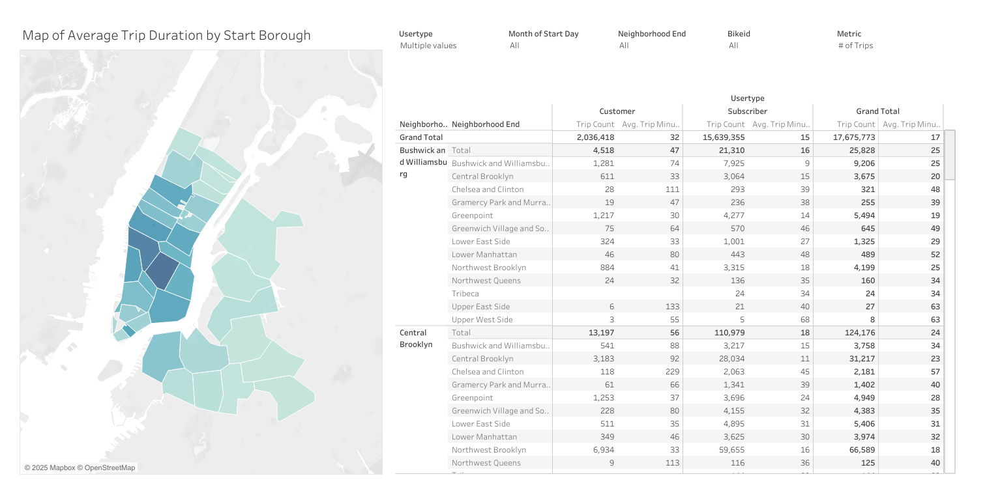
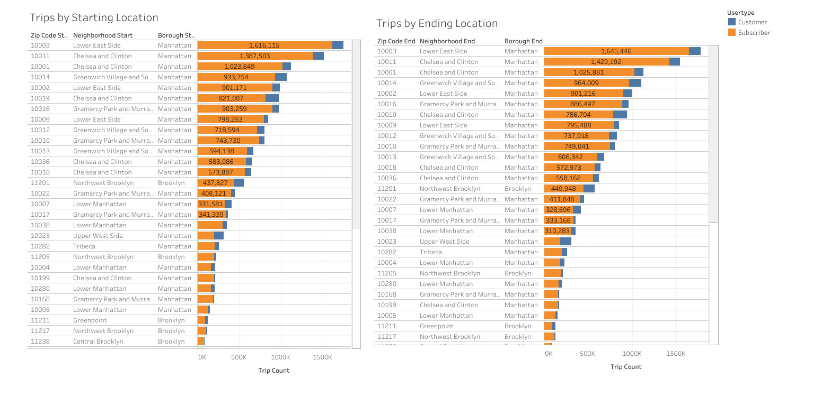

## Step 3 - Visualizations
After having finished the planning documents and obtained the relevant data using an ETL pipeline, we've now been asked to create a series of dashboards for the Cyclistic product development team. In particular, they have a few specific goals in mind for visualizations:
- Understand what customers want, what makes a successful product, and how new stations might alleviate demand in different geographical areas
- Understand how the current line of bikes are used
- Apply customer usage insights to inform new station growth
- Understand how different users (subscribers and non-subscribers) use the bikes

### 1. Connect datasets to Tableau
As the query results were saved as BigQuery tables, they were then exported to Google Drive to allow for Tableau to connect directly through its Google Drive connector. 
### 2. Create dashboard mockups
After the dataset was loaded into Tableau, a mockup (or sketch) of what each dashboard should look like was made to guide the process and give me, as the Business Intelligence professional, a platform to jump off of, so to speak. These mockups do not need to be uber-specific, but should correctly pinpoint the type of chart used, what dimensions/measures go on what axis, etc. We present these mockups to stakeholders to seek out their opinion and if any drastic changes need to be made.
### 3. Create charts
To satisfy the product development team's wants, I created three dashboards, each consisting of two charts:
- Dashboard 1: A map showing the average of trip minutes + a table showing trip statistics for each neighbourhood start-end combination for the summer months, split by user type (customer vs subscriber). The dashboard also includes filters for various metrics (precipitation, temperature, windspeed, trip count), which changes the color of the map accordingly. Each neighbourhood is shaded according to how large the metric value is; darker means larger. Additionally, there are filters for neighbourhood, user type, bike ID, and month to filter the information displayed in the table.

 
These visualizations help us understand how the current line of bikes are being used by customers and subscribers alike.

- Dashboard 2: Two horizontal bar charts that list the number of trips to and from each location, sorted in descending order. This helps to visualize which locations are the most used, and how to potentially alleviate these locations of some demand, in order to prevent a situation where riders suddenly arrive to the bike station to find that there are no more bikes available.

 
For example, we see from the above visualization that Manhattan deals with a lot of bike traffic, especially the neighbourhoods of Lower East Side and Chelsea and Clinton. Perhaps the city might consider adding more station in these sorts of neighbourhoods to fix demand issues.

- Dashboard 3: Year over Year and Seasonal/Monthly Trends: An area chart showing bike trip count from the beginning of 2019 to the end of 2020 on a monthly basis, along with a table detailing how these trips were distributed by location of origin throughout New York City's neighbourhoods.

 
Here we observe that winter months see a hit in bike rides, and understandably so, since weather conditions mean that not only is it cold, but bikers are put at increased safety risk due to roads being slippery, and visibility being poor at times. The table corroborates the above observation that Lower East Side and Chelsea and Clinton are large bike "hubs" that see a tremendous amount of traffic compared to the rest of the neighbourhoods.

### 4. Iterate as necessary
It may be possible that the stakeholders that use our BI tool would like for some things to be tweaked, or for content to be added/removed. In this case, we should adhere accordingly to their wishes, and update the dashboards as required. This constant loop of feedback ensures that our tools help stakeholders perform their jobs to the best of their ability.
